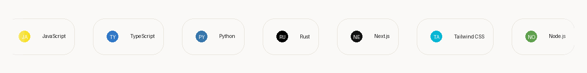

# Prantik Pratim Medhi

 

<strong>Spotify stats</strong>

 

  
  &nbsp;&nbsp;
  

<strong>Top tracks</strong>

  

## Make your own:
(https://github.com/prantikmedhi/spotibadge)

<table>
  <tr>
    <td width="58%" valign="top">
      <h2>About</h2>
      

        I am currently learning how to turn ideas into useful software: shaping the product, building the interface, connecting APIs, testing workflows, and writing documentation that makes the work easier to understand.
      

      

        My recent projects focus on agent tooling, research automation, data review workflows, Splunk development concepts, and small business utilities.
      

    </td>
    <td width="42%" valign="top">
      
    </td>
  </tr>
</table>

## Stack

  

## Selected Work

| Project | What it does | Stack |
|---|---|---|
| **SPL Forge** (https://github.com/Utpal-Kalita/SPL-Forge) | Turns natural language into SPL queries, dashboards, alerts, and app-ready Splunk artifacts. | TypeScript, Node.js, Splunk, MCP |
| [**Lore**](https://github.com/prantikmedhi/lore) | Orchestrates NotebookLM-style research pipelines into repeatable, cited artifacts. | Python, NotebookLM, MCP, CLI |
| [**ClawNexus**](https://github.com/prantikmedhi/ClawNexus) | Visual console for agent gateways, sessions, providers, skills, jobs, and MCP-style tooling. | Vite, React, TypeScript |
| [**b2b-leads-ai**](https://github.com/prantikmedhi/b2b-leads-ai) | Finds and reviews local business leads with filtering and Google Sheets export. | Next.js, Tailwind CSS, OpenRouter, Google Sheets |
| [**MetaReview**](https://github.com/prantikmedhi/MetaReview) | Reviews SQL diffs with OpenMetadata context and risk-focused GitHub comments. | Python, GitHub Actions, OpenMetadata, Gemini |
| [**ProofOrBluff**](https://github.com/bytewizard42i/ProofOrBluff_MLH_Midnight) | Privacy-first bluffing card game where claims are challenged with zero-knowledge proof concepts. | JavaScript, Midnight, game design |

## Current Focus

- Building products that feel complete, not just impressive in a demo.
- Getting better at DevOps, deployment workflows, and the operational side of shipping software.
- Thinking more seriously about security in architecture, integrations, and day-to-day engineering decisions.
- Making tools and interfaces that are clear, useful, and easy for people to work with.

 

  <a href="https://prantikmedhi.co.in">Portfolio</a> ·
  <a href="mailto:info.prantik@gmail.com">Email</a> ·
  <a href="https://www.linkedin.com/in/prantikmedhi">LinkedIn</a> ·
  <a href="https://x.com/prantikmedhii">X</a> ·
  <a href="https://github.com/prantikmedhi">GitHub</a>

